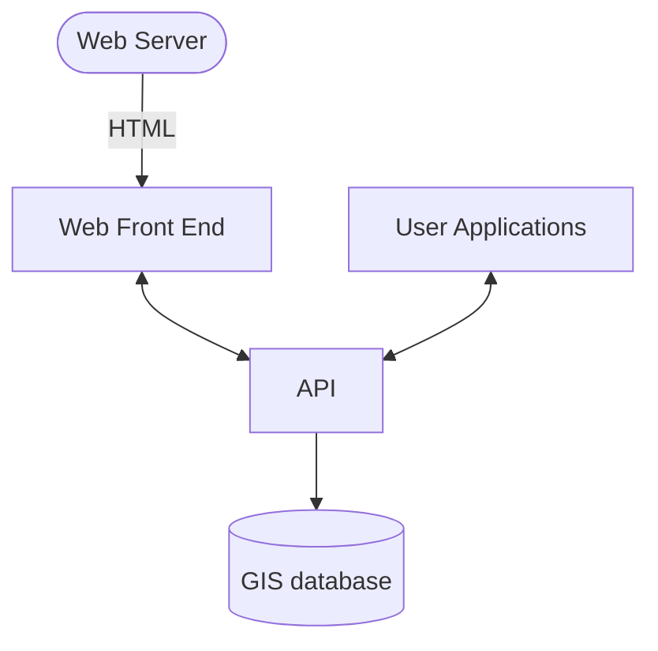
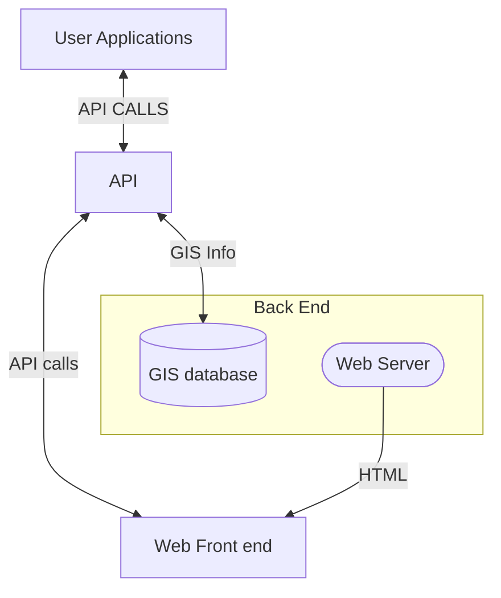

## challenge 4.1  
_Yaremi Dominguez_   
_October 21, 2026_

**Diagram one**

```mermaid
flowchart TD
    Start([Web Server]) --> |HTML| Browse[Web Front End]
    Browse <--> Cart[API]
    Box[User Applications] <--> Cart[API]
    Cart[API]--> DB@{ shape: cyl, label: "GIS database" }
```

**Diagram two**

```mermaid
flowchart TD
    Start[User Applications]<-->|API CALLS|Browse[API]
   Browse[API] <-->|GIS Info|DB

    subgraph be[Back End]
        DB@{ shape: cyl, label: "GIS database" }
        Letter@{ shape: stadium, label: "Web Server" }

    end
    Browse[API]<-->|API calls|final[Web Front end]
    Letter --> |HTML| final[Web Front end]
```