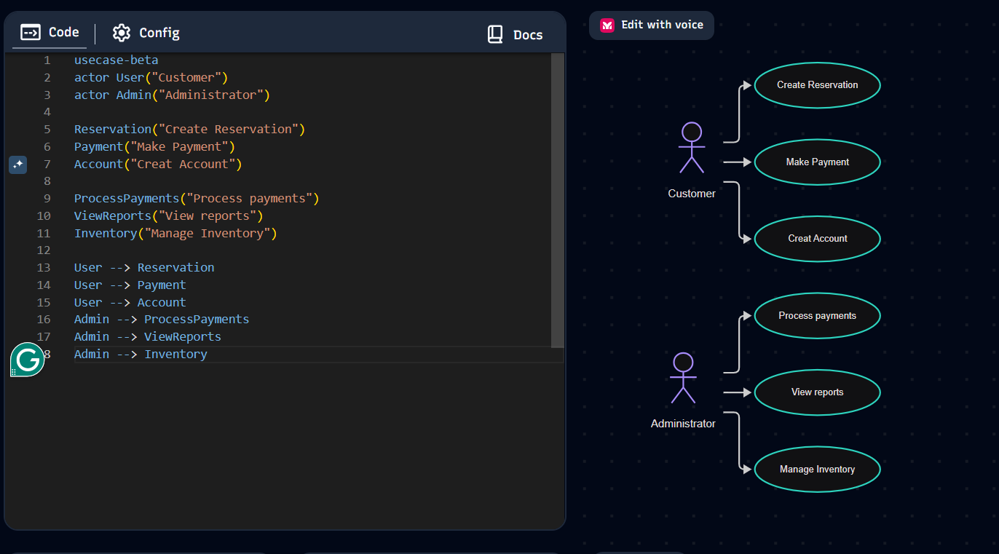

## Project 2
_Yaremi Dominguez_  
_October 7, 2026_

**Overview**
The software system for the bike shop is meant to be used by customers for making reservations by viewing available inventory, and by management to view reports, manage reservations and payments, and manage inventory.

**User Scenarios**  
1) Panchita is a Grandma trying to bond with her 3 grandkids by riding bikes as a family. She goes online to reserve 4 bikes: one adult, one child, and two youth bikes. Panchita begins by inputting her information to make next visit quicker. She then picks the day and time slot she desires from the online calender. Then she scrolls through bike categories and searches children bikes to find in stock bikes she'll need. She expects bike inventopry to be up tp date at the time of booking, and expects the bikes to be ready for her at the bike shop on the specified day/time. After selection shes moved to the overview and payment page where she secures her reservation with her card.  

2) Isidro is the assistant manager of the bike shop, and before opening the shop he logs into the website check for upcoming reservations. Hes in charge that day so he needs to prepare. He logs in, goes to upcoming reservations, and expects a real time tracking status of reservations. If reservations arent in real time he could be unprepared for a same day reservation facing cancelation from the customer. Along with real time tracking, after checking for the days reservations he also needs to log into the bike inventory to see an up-to-date inventory count to know which bikes to prepare and which ones are unavailable. 

3) **LLM** : Marisol is a new employee at the bike shop and during her first shift shes at the kiosk station. A customer arrives with no reservation, so Marisol uses the kiosk interface to start an in-store rental. She accidentally tries to assign a unavailable bike so the system blocker the action and displays a message explaining the bike is out of service and suggests alternative bikes in the same category. Marisol is able to pick a different bike, completing the rental and learning how the system prevents her from making inventory mistakes that could frustrate customers or cause safety issues.

4) **LLM** : Jose is visiting Bend for the weekend and decides on a whim to rent a mountain bike for a trail ride. He opend the bike shop website on his phone and uses the "Recommended Bikes for Local Trails" feature to quickly find a suitable model. Jose tries to reserve a bike for 30 minutes from now but gets a message from the system saying the bike he wanted is now reserved. The system suggest another bike that will be ready in 30 minutes. Jose chooses the bike, confirms his time slot, and pays. He expects the system to be up to date, and guide him clearly when making last minute decisions and appreciates that it prevented him from booking an unavailable bike.

**Non-Goals**
* we are not doing a cancellation process for charging bikes not returned
* we are not creating an unavailable bikes system (only worrying about how to connect it)
* We are not including outreach ads  

**Use Case Diagrams**  

